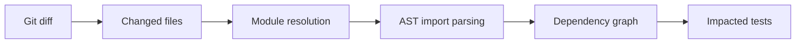

# Usage Guide

## Basic Usage

Activate the plugin by passing the `--impacted` flag along with `--impacted-module` to pytest:

```bash
pytest --impacted --impacted-module=my_package
```

This runs only the tests impacted by files with unstaged modifications in your current git repository.

!!! note
    The `--impacted-module` value must be a valid Python package name (underscores, not hyphens).
    If you accidentally use hyphens, the plugin will suggest the corrected name.

## Git Modes

### Unstaged Mode (default)

Compares your working directory changes (including untracked files) against the current HEAD:

```bash
pytest --impacted --impacted-module=my_package --impacted-git-mode=unstaged
```

### Branch Mode

Compares all commits on your current branch against a base branch:

```bash
pytest --impacted \
       --impacted-module=my_package \
       --impacted-git-mode=branch \
       --impacted-base-branch=main
```

The `--impacted-base-branch` flag accepts any valid git ref, including expressions like `HEAD~4`.

## External Tests Directory

When your tests live outside the namespace package (a common project layout), use `--impacted-tests-dir` so the dependency graph includes them:

```bash
pytest --impacted \
       --impacted-module=my_package \
       --impacted-tests-dir=tests
```

The tests directory must be importable as a Python package (i.e., contain an `__init__.py` or be otherwise discoverable).

## Impact Analysis Strategies

The plugin uses a modular, strategy-based architecture to determine which tests are affected by code changes. Strategies are composable — the default pipeline combines two built-in strategies.

### ASTImpactStrategy

The core strategy. It uses static analysis to:

1. Discover all submodules via filesystem scanning (no imports executed)
2. Parse each source file's AST to extract import relationships
3. Build a dependency graph with [NetworkX](https://networkx.org/)
4. Trace transitive dependencies from changed modules to test modules

### PytestImpactStrategy

Extends the AST analysis with pytest-specific dependency detection:

- **`conftest.py` handling**: When a `conftest.py` file is modified, all tests in the same directory and subdirectories are considered impacted. This is critical because `conftest.py` files are implicitly loaded by pytest at runtime and are **not visible through normal import analysis**.
- Designed to be extended with additional pytest-specific heuristics in the future.

### CompositeImpactStrategy

Combines multiple strategies, deduplicating and sorting results. The default composition is:

```python
CompositeImpactStrategy([
    ASTImpactStrategy(),
    PytestImpactStrategy(),
])
```

### Custom Strategies

You can implement your own strategy by subclassing `ImpactStrategy` and passing it to the `get_impacted_tests()` API:

```python
from pathlib import Path
from pytest_impacted.api import get_impacted_tests
from pytest_impacted.strategies import ImpactStrategy

class MyCustomStrategy(ImpactStrategy):
    def find_impacted_tests(self, changed_files, impacted_modules, ns_module, **kwargs):
        # your logic here
        ...

impacted = get_impacted_tests(
    impacted_git_mode="branch",
    impacted_base_branch="main",
    root_dir=Path("."),
    ns_module="my_package",
    strategy=MyCustomStrategy(),
)
```

## CI Integration

For CI pipelines where git analysis and test execution happen in separate stages, use the standalone `impacted-tests` CLI:

```bash
# Stage 1: identify impacted tests
impacted-tests --module=my_package --git-mode=branch --base-branch=main > impacted_tests.txt

# Stage 2: run only those tests
pytest $(cat impacted_tests.txt)
```

## Configuration via `pyproject.toml`

All CLI options can be set as defaults in your `pyproject.toml` (or `pytest.ini`):

```toml
[tool.pytest.ini_options]
impacted = true
impacted_module = "my_package"
impacted_git_mode = "branch"
impacted_base_branch = "main"
impacted_tests_dir = "tests"
```

CLI flags override these defaults.

## Input Validation

The plugin validates configuration early and provides helpful error messages:

| Scenario | What happens |
|----------|-------------|
| `--impacted-module=my-package` (hyphens) | Suggests `my_package` if it exists |
| `--impacted-module=nonexistent` | Clear error with instructions to check the package name and working directory |
| `--impacted-tests-dir=bad_path` | Error indicating the directory doesn't exist |
| `--impacted-tests-dir=exists_but_not_importable` | Error explaining the directory needs to be an importable Python package |
| `--impacted-base-branch=no_such_branch` | Error listing available git refs |

## All Options

| Option | Default | Description |
|--------|---------|-------------|
| `--impacted` | `false` | Enable the plugin |
| `--impacted-module` | *(required)* | Top-level Python package to analyze |
| `--impacted-git-mode` | `unstaged` | Git comparison mode: `unstaged` or `branch` |
| `--impacted-base-branch` | *(required for branch mode)* | Base branch/ref for branch-mode comparison |
| `--impacted-tests-dir` | `None` | Directory containing tests outside the package |

## How It Works (Pipeline)



1. **Git introspection** identifies which files changed (unstaged edits or branch diff)
2. **Filesystem discovery** maps file paths to Python module names — without importing anything
3. **AST parsing** (via [astroid](https://pylint.pycqa.org/projects/astroid/en/latest/)) extracts import relationships from source files
4. **Dependency graph** (via [NetworkX](https://networkx.org/)) traces transitive dependencies from changed modules to test modules
5. **Test filtering** skips tests whose modules are not in the impact set

The philosophy is to **err on the side of caution**: false positives (running a test that didn't need to run) are preferred over false negatives (missing a test that should have run).
