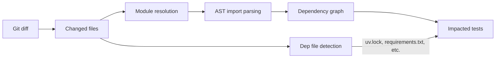

# Usage Guide

## Basic Usage

Activate the plugin by passing the `--impacted` flag along with `--impacted-module` to pytest:

```bash
pytest --impacted --impacted-module=my_package
```

This runs only the tests impacted by files with unstaged modifications in your current git repository.

!!! note
    The `--impacted-module` value must be a valid Python package name (underscores, not hyphens).
    If you accidentally use hyphens, the plugin will suggest the corrected name.

## Git Modes

### Unstaged Mode (default)

Compares your working directory changes (including untracked files) against the current HEAD:

```bash
pytest --impacted --impacted-module=my_package --impacted-git-mode=unstaged
```

### Branch Mode

Compares all commits on your current branch against a base branch:

```bash
pytest --impacted \
       --impacted-module=my_package \
       --impacted-git-mode=branch \
       --impacted-base-branch=main
```

The `--impacted-base-branch` flag accepts any valid git ref, including expressions like `HEAD~4`.

## External Tests Directory

When your tests live outside the namespace package (a common project layout), use `--impacted-tests-dir` so the dependency graph includes them:

```bash
pytest --impacted \
       --impacted-module=my_package \
       --impacted-tests-dir=tests
```

The tests directory does **not** need to contain `__init__.py` — the plugin uses filesystem-based discovery that matches pytest's own behavior.

## Monorepo / src-Layout Support

The plugin works in monorepos where the Python project lives in a subdirectory — the `.git` directory does not need to be in the current working directory. Parent directories are searched automatically to find the git repository.

### src-Layout Projects

For projects using the [src-layout](https://packaging.python.org/en/latest/discussions/src-layout-vs-flat-layout/) convention (e.g. `src/my_package/`), point `--impacted-module` at the full path including the `src/` prefix:

```bash
# From the project directory (e.g. monorepo/backend/)
pytest --impacted \
       --impacted-module=src/my_package \
       --impacted-tests-dir=tests
```

The plugin automatically detects that `src/` is not a Python package (no `__init__.py`) and uses the correct importable module name (`my_package`) for dependency analysis. This means AST-parsed imports like `from my_package import ...` will correctly match discovered modules.

!!! tip
    If you accidentally pass just `--impacted-module=my_package` in a src-layout project, the plugin will detect that `src/my_package` exists and suggest the correct flag.

### Monorepo Layout

In a monorepo where the Python project is nested under a subdirectory:

```
monorepo/              ← git root
  backend/             ← working directory (pyproject.toml here)
    src/
      my_package/
    tests/
  frontend/
```

Run pytest from the `backend/` directory as usual. The plugin will:

1. Find the git repository by searching parent directories
2. Convert git-relative file paths (e.g. `backend/src/my_package/module.py`) to working-directory-relative paths (e.g. `src/my_package/module.py`)
3. Only consider changes within the working directory — changes in sibling directories (e.g. `frontend/`) are ignored

## Impact Analysis Strategies

The plugin uses a modular, strategy-based architecture to determine which tests are affected by code changes. Strategies are composable — the default pipeline combines three built-in strategies.

### ASTImpactStrategy

The core strategy. It uses static analysis to:

1. Discover all submodules via filesystem scanning (no imports executed)
2. Parse each source file's AST to extract import relationships
3. Build a dependency graph with [NetworkX](https://networkx.org/)
4. Trace transitive dependencies from changed modules to test modules

### PytestImpactStrategy

Extends the AST analysis with pytest-specific dependency detection:

- **`conftest.py` handling**: When a `conftest.py` file is modified, all tests in the same directory and subdirectories are considered impacted. This is critical because `conftest.py` files are implicitly loaded by pytest at runtime and are **not visible through normal import analysis**.
- Designed to be extended with additional pytest-specific heuristics in the future.

### DependencyFileImpactStrategy

Detects changes in dependency and configuration files. When these files change, any test could potentially be affected — so **all test modules are marked as impacted**.

Monitored files include:

- `uv.lock`, `requirements.txt`, `pyproject.toml`
- `Pipfile`, `Pipfile.lock`, `poetry.lock`
- `setup.py`, `setup.cfg`
- `requirements/*.txt` (nested requirements files)

This strategy is enabled by default. To disable it, use:

```bash
pytest --impacted --impacted-module=my_package --no-impacted-dep-files
```

!!! tip
    This is especially useful in CI where dependency version bumps (e.g. updating `uv.lock`) don't change any `.py` files but could still break tests due to changed third-party behavior.

### CompositeImpactStrategy

Combines multiple strategies, deduplicating and sorting results. The default composition is:

```python
CompositeImpactStrategy([
    ASTImpactStrategy(),
    PytestImpactStrategy(),
    DependencyFileImpactStrategy(),
])
```

### Custom Strategies

You can implement your own strategy by subclassing `ImpactStrategy` and passing it to the `get_impacted_tests()` API:

```python
from pathlib import Path
from pytest_impacted.api import get_impacted_tests
from pytest_impacted.strategies import ImpactStrategy

class MyCustomStrategy(ImpactStrategy):
    def find_impacted_tests(self, changed_files, impacted_modules, ns_module, **kwargs):
        # your logic here
        ...

impacted = get_impacted_tests(
    impacted_git_mode="branch",
    impacted_base_branch="main",
    root_dir=Path("."),
    ns_module="my_package",
    strategy=MyCustomStrategy(),
)
```

## Strategy Extensions (Plugin System)

Third-party packages can register custom strategies as installable plugins. Once installed, they are automatically discovered and composed into the analysis pipeline alongside the built-in strategies.

### Creating an Extension

An extension is a standard Python package that registers a strategy class via the `pytest_impacted.strategies` entry point group.

#### Minimal Extension (No Configuration)

```python
# my_extension/strategy.py
from pytest_impacted import ImpactStrategy

class MyStrategy(ImpactStrategy):
    def find_impacted_tests(self, changed_files, impacted_modules, ns_module, **kwargs):
        # Custom impact analysis logic
        return ["tests.test_something"]
```

```toml
# pyproject.toml for the extension package
[project]
name = "pytest-impacted-my-extension"
dependencies = ["pytest-impacted>=0.19"]

[project.entry-points."pytest_impacted.strategies"]
my_extension = "my_extension.strategy:MyStrategy"
```

The entry point name (`my_extension`) is the user-facing identifier used for enabling/disabling the extension.

#### Extension with Configuration

Extensions can declare configuration options that are automatically registered as CLI flags and ini settings:

```python
from pytest_impacted import ImpactStrategy, ConfigOption

class CoverageStrategy(ImpactStrategy):
    config_options = [
        ConfigOption(name="coverage_file", help="Path to .coverage file", default=".coverage"),
        ConfigOption(name="threshold", help="Minimum coverage %% to consider", type=int, default=80),
    ]
    priority = 50  # Lower = runs earlier (default is 100)

    def __init__(self, coverage_file: str = ".coverage", threshold: int = 80):
        self.coverage_file = coverage_file
        self.threshold = threshold

    def find_impacted_tests(self, changed_files, impacted_modules, ns_module, **kwargs):
        # Use self.coverage_file and self.threshold
        ...
```

Config options are automatically namespaced to avoid collisions:

- **CLI flag**: `--impacted-ext-{extension_name}-{option_name}` (hyphens)
- **ini setting**: `impacted_ext_{extension_name}_{option_name}` (underscores)

For the example above:

```bash
pytest --impacted --impacted-ext-coverage-threshold 90
```

```toml
[tool.pytest.ini_options]
impacted_ext_coverage_threshold = "90"
impacted_ext_coverage_coverage_file = ".coverage.ci"
```

!!! tip
    The `ConfigOption` dataclass supports `str`, `bool`, `int`, and `float` types. Values from config files are automatically coerced to the declared type.

#### Duck-Typed Extensions (Zero Dependency)

Extensions don't need to inherit from `ImpactStrategy`. Any class with a `find_impacted_tests` method works:

```python
# No import from pytest_impacted at all!
class MyLightweightStrategy:
    def find_impacted_tests(self, changed_files, impacted_modules, ns_module, **kwargs):
        return [...]
```

This is validated at runtime using the `StrategyProtocol` (a `typing.Protocol`).

### Using Extensions

Once installed, extensions are automatically discovered and added to the strategy pipeline. No additional configuration is needed beyond installing the package.

#### Disabling Extensions

To disable a specific extension, use `--impacted-disable-ext` (repeatable):

```bash
pytest --impacted --impacted-disable-ext my_extension
```

Or in `pyproject.toml`:

```toml
[tool.pytest.ini_options]
impacted_disable_ext = ["my_extension"]
```

#### Viewing Loaded Extensions

Extensions are listed in the pytest report header:

```
pytest-impacted: ..., extensions=my_extension,coverage
```

### Extension Priority

Extensions can declare a `priority` class variable to control execution order. Lower values run earlier. The default priority is `100`. Built-in strategies always run first, followed by extensions sorted by priority.

```python
class EarlyStrategy(ImpactStrategy):
    priority = 10  # Runs before other extensions
    ...

class LateStrategy(ImpactStrategy):
    priority = 200  # Runs after other extensions
    ...
```

!!! note
    Since `CompositeImpactStrategy` unions all results, execution order rarely matters for correctness. Priority is mainly useful if an extension needs to set up shared state or log information before others run.

### Error Handling

The extension system is designed to be fault-tolerant:

- **Import errors**: If an extension package fails to import, it is skipped with a warning log. Other extensions and built-in strategies continue to work.
- **Instantiation errors**: If a strategy's `__init__` raises an exception, the extension is skipped.
- **Invalid classes**: If an entry point resolves to a class without `find_impacted_tests`, it is skipped with a warning.

Extensions never prevent the core pytest-impacted functionality from working.

## CI Integration

For CI pipelines where git analysis and test execution happen in separate stages, use the standalone `impacted-tests` CLI:

```bash
# Stage 1: identify impacted tests
impacted-tests --module=my_package --git-mode=branch --base-branch=main > impacted_tests.txt

# Stage 2: run only those tests
pytest $(cat impacted_tests.txt)
```

## Configuration via `pyproject.toml`

All CLI options can be set as defaults in your `pyproject.toml` (or `pytest.ini`):

```toml
[tool.pytest.ini_options]
impacted = true
impacted_module = "my_package"
impacted_git_mode = "branch"
impacted_base_branch = "main"
impacted_tests_dir = "tests"
no_impacted_dep_files = false  # set to true to disable dep file detection
```

CLI flags override these defaults.

## Input Validation

The plugin validates configuration early and provides helpful error messages:

| Scenario | What happens |
|----------|-------------|
| `--impacted-module=my-package` (hyphens) | Suggests `my_package` if it exists |
| `--impacted-module=my_package` (src-layout) | Suggests `src/my_package` if found under `src/` |
| `--impacted-module=nonexistent` | Clear error with instructions to check the package name and working directory |
| `--impacted-tests-dir=bad_path` | Error indicating the directory doesn't exist |
| `--impacted-base-branch=no_such_branch` | Error listing available git refs |
| No git repository found | Clear error indicating no `.git` found at or above the working directory |

## All Options

| Option | Default | Description |
|--------|---------|-------------|
| `--impacted` | `false` | Enable the plugin |
| `--impacted-module` | *(required)* | Top-level Python package to analyze |
| `--impacted-git-mode` | `unstaged` | Git comparison mode: `unstaged` or `branch` |
| `--impacted-base-branch` | *(required for branch mode)* | Base branch/ref for branch-mode comparison |
| `--impacted-tests-dir` | `None` | Directory containing tests outside the package |
| `--no-impacted-dep-files` | `false` | Disable dependency file change detection |
| `--impacted-disable-ext` | `[]` | Disable a strategy extension by name (repeatable) |

## How It Works (Pipeline)


```mermaid
graph LR
    A[Git diff] --> B[Changed files]
    B --> C[Module resolution]
    C --> D[AST import parsing]
    D --> E[Dependency graph]
    E --> G[Impacted tests]
    B --> F[Dep file detection]
    F -->|uv.lock, requirements.txt, etc.| G
```

1. **Git introspection** identifies which files changed (unstaged edits or branch diff)
2. **Filesystem discovery** maps file paths to Python module names — without importing anything
3. **AST parsing** (via [astroid](https://pylint.pycqa.org/projects/astroid/en/latest/), or the optional Rust extension using [ruff's parser](https://github.com/astral-sh/ruff)) extracts import relationships from source files
4. **Dependency graph** (via [NetworkX](https://networkx.org/)) traces transitive dependencies from changed modules to test modules
5. **Dependency file detection** — if files like `uv.lock`, `requirements.txt`, or `pyproject.toml` changed, all tests are marked as impacted regardless of import analysis
6. **Test filtering** skips tests whose modules are not in the impact set

The philosophy is to **err on the side of caution**: false positives (running a test that didn't need to run) are preferred over false negatives (missing a test that should have run).

## Performance: Rust Acceleration

For large codebases with many modules, import parsing can become a bottleneck. An optional Rust extension provides **37-65x faster** import parsing using [ruff's Python parser](https://github.com/astral-sh/ruff) and [rayon](https://github.com/rayon-rs/rayon) for parallel file processing.

### Installation

Install with the `fast` extra to get pre-built Rust wheels (no Rust toolchain needed):

```bash
pip install pytest-impacted[fast]
```

Or with [uv](https://docs.astral.sh/uv/):

```bash
uv add pytest-impacted[fast]
```

For development from source (requires a [Rust toolchain](https://rustup.rs/) and [maturin](https://www.maturin.rs/)):

```bash
pip install maturin
cd rust && maturin develop --release
```

### How It Works

When the Rust extension (`pytest_impacted_rs`) is installed, `build_dep_tree()` automatically uses parallel batch parsing instead of sequential astroid parsing. No configuration or flags are needed — the extension is detected at import time.

The Rust extension:

1. Reads all source files in parallel via rayon
2. Parses Python ASTs using ruff's hand-written recursive descent parser (the same parser used by the ruff linter)
3. Extracts import statements by recursively walking all statement bodies (including `if`, `try`, `with`, function, and class blocks)
4. Returns results as Python `list[str]` — only the final data crosses the Rust/Python boundary

### Benchmarks

Run the included benchmark script to measure speedup on your codebase:

```bash
python -m benchmarks.bench_parsing --module my_package --tests-dir tests
```

!!! note
    The Rust extension is **completely optional**. When not installed, the pure-Python (astroid) implementation is used automatically. All functionality works identically in both modes.
