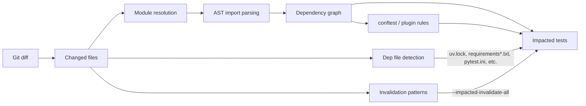

# Usage Guide

## Requirements

Python 3.11+, and a **git 2.24+** CLI available on `PATH`. Revisions are passed to git
after `--end-of-options` (added in git 2.24) so that a ref can never be parsed as a
command-line option.

## Basic Usage

Activate the plugin by passing the `--impacted` flag along with `--impacted-module` to pytest:

```bash
pytest --impacted --impacted-module=my_package
```

This runs only the tests impacted by files with uncommitted changes (staged or unstaged, including deletions) and untracked files in your current git repository.

!!! note
    The `--impacted-module` value must be a valid Python package name (underscores, not hyphens).
    If you accidentally use hyphens, the plugin will suggest the corrected name.

## Git Modes

### Unstaged Mode (default)

Counts every uncommitted change — whether or not it has been staged with `git add` — plus untracked files. Deletions and renames count too: a removed `conftest.py` or lockfile still reaches the pattern-based strategies, and a rename is reported as a deletion plus an addition:

```bash
pytest --impacted --impacted-module=my_package --impacted-git-mode=unstaged
```

### Branch Mode

Compares your current `HEAD` with the point where it forked from a base ref — `git diff <base>...HEAD`, the same diff a pull request shows. Commits the base branch gained after you branched are *not* your changes, so they no longer select tests:

```bash
pytest --impacted \
       --impacted-module=my_package \
       --impacted-git-mode=branch \
       --impacted-base-branch=main
```

The `--impacted-base-branch` flag accepts any valid git ref, including expressions like `HEAD~4`.

When there is no fork point — unrelated histories, or a shallow clone whose history stops short of it — pytest-impacted diffs against the base branch's tip instead, which still covers every change on your branch, and prints a warning saying which case applies. In CI, the base ref must be fetched at all: a stock `actions/checkout` (`fetch-depth: 1`) fetches only the checked-out commit, so `--impacted-base-branch=origin/main` is rejected as unknown. `fetch-depth: 0` fetches everything; a shallow `git fetch --depth=N origin main` works too, falling back if the fork point is deeper than `N`. With several fork points (criss-cross merges) it combines the diffs from each. Fetch enough history (`fetch-depth: 0`) for the precise diff. To always diff against the tip (`git diff <base> HEAD`), pass `--impacted-no-merge-base` (ini: `impacted_no_merge_base = true`).

## External Tests Directory

When your tests live outside the namespace package (a common project layout), use `--impacted-tests-dir` so the dependency graph includes them:

```bash
pytest --impacted \
       --impacted-module=my_package \
       --impacted-tests-dir=tests
```

The tests directory does **not** need to contain `__init__.py` — the plugin uses filesystem-based discovery that matches pytest's own behavior.

## Monorepo / src-Layout Support

The plugin works in monorepos where the Python project lives in a subdirectory — the `.git` directory does not need to be in the project directory. Parent directories are searched automatically to find the git repository.
**Note:** Changed files outside the rootdir subtree cannot be resolved to Python modules, so they never impact tests through import analysis — with one exception: an `__init__.py` in a directory above the rootdir, when every directory from it down to the rootdir is a package too, selects every test (see [package `__init__.py` files](#astimpactstrategy)). They *are* still seen by the file-pattern strategies: a sibling `frontend/requirements.txt`, or a file matching an `--impacted-invalidate-all` glob, still marks every test as impacted.

Paths are resolved against pytest's `rootdir` (or the CLI's `--root-dir`), not the directory you happen to run from, so `--impacted-module` and `--impacted-tests-dir` are relative to that root and running from a subdirectory works.

### src-Layout Projects

For projects using the [src-layout](https://packaging.python.org/en/latest/discussions/src-layout-vs-flat-layout/) convention (e.g. `src/my_package/`), point `--impacted-module` at the full path including the `src/` prefix:

```bash
# From the project directory (e.g. monorepo/backend/)
pytest --impacted \
       --impacted-module=src/my_package \
       --impacted-tests-dir=tests
```

The plugin automatically detects that `src/` is not a Python package (no `__init__.py`) and uses the correct importable module name (`my_package`) for dependency analysis. This means AST-parsed imports like `from my_package import ...` will correctly match discovered modules.

Sub-directories of the package do not need an `__init__.py` either: Python imports them as [namespace packages](https://peps.python.org/pep-0420/), so `my_package/processors/ocr.py` is analysed as `my_package.processors.ocr` whether or not `processors/` has one — and test files kept in such a directory inside the package are found without `--impacted-tests-dir`.

The package directory itself may sit inside a namespace package too (`src/company/my_package`, with no `__init__.py` in `company/`). Imports such as `from company.my_package import ...` and `from my_package import ...` both match, whichever of the two you pass to `--impacted-module`, because the plugin cannot know which directory is on `sys.path` and accepts every candidate.

!!! tip
    If you accidentally pass just `--impacted-module=my_package` in a src-layout project, the plugin will detect that `src/my_package` exists and suggest the correct flag.

### Monorepo Layout

In a monorepo where the Python project is nested under a subdirectory:

```
monorepo/              ← git root
  backend/             ← rootdir (pyproject.toml here)
    src/
      my_package/
    tests/
  frontend/
```

Run pytest from the `backend/` directory as usual. The plugin will:

1. Find the git repository by searching parent directories
2. Convert git-root-relative file paths (e.g. `backend/src/my_package/module.py`) to rootdir-relative paths (e.g. `src/my_package/module.py`)
3. Resolve only changes inside the rootdir subtree to modules — sibling changes (e.g. `frontend/`) contribute nothing to import analysis, though the dependency-file and invalidation-pattern strategies still see them (as absolute paths)

## Impact Analysis Strategies

The plugin uses a modular, strategy-based architecture to determine which tests are affected by code changes. Strategies are composable — the default pipeline combines the built-in strategies below (InvalidationFileImpactStrategy only when configured).

### ASTImpactStrategy

The core strategy. It uses static analysis to:

1. Discover the package and all its submodules via filesystem scanning (no imports executed)
2. Parse each source file's AST to extract import relationships
3. Build a dependency graph with [NetworkX](https://networkx.org/)
4. Trace transitive dependencies from changed modules to test modules

The package's own `__init__.py` is a module too. A test that imports from the package root (`import my_package` or `from my_package import name`), itself or through a module that does (including `from . import name` in a top-level module), depends on the `__init__.py` and on everything it imports, directly or not. Editing the `__init__.py`, or any module it imports, selects that test.

**Package `__init__.py` files.** Python runs every package's `__init__.py` above a module before the module itself: `from my_package.core.x import f` runs `my_package/__init__.py` and `my_package/core/__init__.py` too, though it names neither. So (since 0.34) editing, adding or deleting an `__init__.py` — the package root's, a sub-package's, one in the tests directory, or one above `--impacted-module` (`backend/__init__.py` for `backend/app`) — counts as a change to every module inside its package. That selects every test importing anything inside the package, directly or not — even a module missing from it, as an optional import in `try`/`except ImportError` is — and, for tests kept inside the package or in a tests directory that is itself a package (with `__init__.py`), every test beneath it. The pytest rules see those modules as changed too: a conftest importing one selects the tests beneath it (for application code, only with `--impacted-conftest-imports`), and a package holding a `pytest_plugins` module selects every test. It is only the `__init__.py` itself that reaches the whole package: a module it imports (a re-export) is linked to the tests that import from the package root by name, not to every test importing a sub-module, although Python runs it for those too. An `__init__.py` above the rootdir (in a monorepo holding the project) changes nothing, since imports start inside the rootdir — unless every directory from it down to the rootdir is a package too, when pytest may import your test modules through it: then every test is selected.

**Modules outside the analysed directories.** An import that names no module in `--impacted-module` or `--impacted-tests-dir` is looked up on disk — never imported — under the rootdir and every directory the analysed modules' own names are rooted at (`src/` for `src/my_package`, `backend/` for a tests dir `backend/tests` whose modules import as `tests.x`), and the directories in between that are not regular packages (no `__init__.py`). Not yet the directory pytest itself puts on `sys.path` for a test module outside any package: `import helpers` beside such a test module links to nothing. A file found there joins the graph and is followed like any other module, together with what it imports: a fixture helper in `testing/factories.py` imported by a conftest, a shared library in `src/shared/` your package imports, or a `pytest_plugins` module kept outside both directories. It counts as a test module only if its path from the rootdir looks like one, as for any module. A local package named like a standard-library module (`profile/`, `email/`) is followed too, since with your project first on `sys.path` it shadows the standard library's; a distribution installed into the project directory (`pip install -t .`, with its `.dist-info`) is not. A changed Python file outside the analysed directories that no test depends on — a script, a migration, or a deleted module only untested code imported — is named in a notice, since import analysis selects no tests for it (printed during collection, so not shown under pytest-xdist; a deleted file nothing imports needs none). If tests use it some other way, such as running it as a subprocess, list it in `--impacted-invalidate-all`.

**Deleted modules.** A deleted module that something still imports — inside a function, behind `try`/`except ImportError`, or through a module no test collects — selects the tests of whatever still imports it, so they fail, as they should, rather than being skipped. (An import at the top of a test module already fails its collection.)

### PytestImpactStrategy

Extends the AST analysis with pytest-specific dependency detection:

- **`conftest.py` handling**: When a `conftest.py` file is modified, all tests in the same directory and subdirectories are considered impacted — conftests above your package and tests directory, up to the pytest rootdir (usually the repository root), included. This is critical because `conftest.py` files are implicitly loaded by pytest at runtime and **are not captured through static import analysis**.
- **Test code a conftest imports**: The same applies when a conftest imports changed *test code*, directly or through other modules: another conftest, or a fixture module or helper in `--impacted-tests-dir`. A shared helper imported by a top-level conftest therefore selects every test beneath it, just as editing that conftest does. Conftests above your package and tests directory count too: editing `backend/conftest.py` also selects the tests beneath any conftest that imports it. A helper outside both `--impacted-module` and `--impacted-tests-dir` that a conftest imports is followed too, as test code — unless application code imports it as well, which makes it application code (see [modules outside the analysed directories](#astimpactstrategy) and ConftestImportImpactStrategy below).
- **Application code a conftest imports** — the rest of `--impacted-module` — is *not* followed into the conftest's directory by default. See [ConftestImportImpactStrategy](#conftestimportimpactstrategy-opt-in).
- **`pytest_plugins` modules**: A module named in a `pytest_plugins` declaration is loaded by pytest, not imported by your tests, and pytest registers it for the whole session — its fixtures and hooks reach every test, wherever it was declared. So a change to a plugin module, or to anything it imports, impacts **every test** — as does a change to a plugin loaded with `-p` (on the command line or in `addopts`) or through `PYTEST_PLUGINS`. Unlike conftests, this includes application code a plugin imports, with or without `--impacted-conftest-imports`: keep fixture modules that import your application in conftests if that costs you full runs. Declarations are read from conftests, test modules and (transitively) the plugins themselves, in any form pytest accepts: a comma-separated string or a list/tuple, assigned, `+=`, `.append`/`.extend`, concatenated, including inside module-level `if`/`try`/`match`/loop blocks. Only literal strings are followed, not names computed at runtime; a plugin outside the analysed package and tests directory is followed when it is found on disk, like any imported module — so, as for a plugin inside them, application code it imports makes an edit to that code session-wide. A `-p` or `PYTEST_PLUGINS` plugin outside both directories that nothing imports is session-wide when the plugin file itself changes, but a module only it imports is not followed.

    Two limitations. Editing the *declaration* in a test module (rather than the root `conftest.py`, where any edit already selects every test) selects only that module, even though pytest registers the plugin session-wide — declare plugins in the root conftest. And the standalone `impacted-tests` CLI has no pytest session, so it knows `PYTEST_PLUGINS` but not `-p` options.
- Designed to be extended with additional pytest-specific heuristics in the future.

### ConftestImportImpactStrategy (opt-in)

Always in the default pipeline, but by default it only *reports*: a notice names the conftests that import changed application code (it is printed during collection, so not shown under pytest-xdist). Enabled with `--impacted-conftest-imports` (ini: `impacted_conftest_imports = true`; `impacted-tests` CLI: `--conftest-imports`), it selects too: a conftest that imports changed *application* code, directly or through other modules, then impacts every test in its directory and below, exactly as an edited conftest does. A `db` fixture built on `app/db.py` means a change to `app/db.py` impacts every test under that conftest, even though no test imports `app/db.py` itself. Modules outside `--impacted-module` and `--impacted-tests-dir` are followed too when an analysed module imports them (see [ASTImpactStrategy](#astimpactstrategy)).

*Application code* is what discovering `--impacted-module` finds, less conftests and anything `--impacted-tests-dir` finds too. So if your tests live inside the package, pass `--impacted-tests-dir` (e.g. `my_package/tests`): without it their fixture modules count as application code, and a conftest importing them is only followed with this option. (A tests dir holding the whole package cannot tell the two apart and is ignored for this.) A module outside both directories that the graph follows is application code when application code imports it — a shared library — and test code otherwise, like a fixture helper; a deleted module is placed the same way, by what still imports it.

!!! warning "The trade-off"
    Tests never import their conftest — pytest injects its fixtures by name — so **without this option, a test that uses changed application code only through a conftest fixture is not selected**. This is a deliberate exception to erring on the side of caution, like the `pytest_plugins` limitations above. The option closes the gap, but coarsely: a top-level `tests/conftest.py` that imports your application (an app factory, a database session) makes almost every change select almost every test. It was the default in 0.31.0 and turned typical edits into full runs, which is why it is now opt-in.

    Turn it on where missing a fixture-only dependency costs more than a longer run — for example in a pre-merge CI job. Pass it on that job's command line (`--impacted-conftest-imports`, or `--conftest-imports` for the `impacted-tests` CLI, which does not read the ini) rather than in the ini: an ini `true` cannot be switched off from the command line except with `-o impacted_conftest_imports=false`.

```bash
pytest --impacted --impacted-module=my_package --impacted-conftest-imports
```

### DependencyFileImpactStrategy

Detects changes in dependency and configuration files. When these files change, any test could potentially be affected — so **all test modules are marked as impacted**.

Monitored files — each matched by file name, in any directory:

- Lockfiles and metadata: `uv.lock`, `poetry.lock`, `pdm.lock`, `pixi.lock`, `Pipfile`, `Pipfile.lock`, `pylock*.toml` (PEP 751), `requirements*.lock` (rye), `pyproject.toml`, `setup.py`, `setup.cfg`
- pytest configuration: `pytest.ini`, `.pytest.ini`, `pytest.toml`, `.pytest.toml`, `tox.ini` — settings such as `addopts`, `markers` and `filterwarnings` apply to every test
- Requirements: any `*requirements*.txt` or `*requirements*.in` (`requirements-dev.txt`, `test-requirements.txt`, pip-tools inputs, …) and `*constraints*.txt`

Plus files inside a `requirements/` directory, one or two levels deep: `requirements/*.txt`, `requirements/*/*.txt`, and the same for `.in`. And whichever config file the running pytest actually loaded — including one passed with `-c` under any name (pytest plugin only: the `impacted-tests` CLI has no pytest session).

This strategy is enabled by default. To disable it, use:

```bash
pytest --impacted --impacted-module=my_package --no-impacted-dep-files
```

!!! tip
    This is especially useful in CI where dependency version bumps (e.g. updating `uv.lock`) don't change any `.py` files but could still break tests due to changed third-party behavior.

### InvalidationFileImpactStrategy

Static import analysis cannot see that a test depends on a JSON fixture, a SQL schema, or a YAML config. This strategy is the user-extensible counterpart to the built-in dependency-file list: any changed file matching one of your `--impacted-invalidate-all` globs marks **all** tests as impacted, exactly as a `pyproject.toml` change does. It is only added to the pipeline when at least one pattern is configured.

The option is repeatable:

```bash
pytest --impacted --impacted-module=my_package --impacted-tests-dir=tests \
    --impacted-invalidate-all='*.json' \
    --impacted-invalidate-all='my_package/config/*.yaml'
```

!!! tip "pytest-bdd feature files"
    A `.feature` file is not Python, so an edit to one reaches no test through imports. Add `--impacted-invalidate-all='*.feature'` (or a narrower glob) to run the suite when scenarios change.

Or in `pyproject.toml`:

```toml
[tool.pytest.ini_options]
impacted_invalidate_all = ["*.json", "my_package/config/*.yaml"]
```

Patterns are matched against each changed file's path as reported to the strategies — rootdir-relative for files inside the pytest rootdir, absolute for files elsewhere in the repository — anchored at the end of the path (Python's `PurePath.match` semantics):

- `*.json` matches a JSON file at any depth
- `config/*.json` matches JSON files directly inside any directory named `config`
- `schema.graphql` matches that filename anywhere
- `*` never spans a `/`, so `fixtures/*.sql` does not match `fixtures/sub/x.sql`
- `**` is **not** recursive here — it behaves like a single `*`. To watch a directory tree, list a pattern per depth: `config/*`, `config/*/*`, …

!!! note
    This is independent of `--no-impacted-dep-files`, which only switches off the built-in dependency-file list. Custom invalidation patterns stay active either way.

### CompositeImpactStrategy

Combines multiple strategies, deduplicating and sorting results. The default composition is:

```python
CompositeImpactStrategy(
    [
        ASTImpactStrategy(),
        PytestImpactStrategy(),
        # Selects only with --impacted-conftest-imports; otherwise it reports
        ConftestImportImpactStrategy(report_only=True),
        DependencyFileImpactStrategy(),
        # Only present when --impacted-invalidate-all is set
        InvalidationFileImpactStrategy([...]),
    ]
)
```

### Custom strategies and packaged extensions

The strategy system is fully extensible. You can plug in your own strategy programmatically (a one-off integration via the `get_impacted_tests()` API) or ship one as an installable package that pytest-impacted auto-discovers via Python entry points. Both paths share the same `ImpactStrategy` base class, lifecycle hooks, dependency graph, and helper utilities.

See the **[Extensions](extensions.md)** guide for the full reference: programmatic strategies, packaged-extension entry points, configuration options, lifecycle hooks (`enrich_dep_tree`, `setup`, `teardown`), the extension API helpers, the recommended cross-run cache convention, error handling, and testing patterns.

## CI Integration

For CI pipelines where git analysis and test execution happen in separate stages, use the standalone `impacted-tests` CLI:

```bash
# Stage 1: identify impacted tests. Stop if it fails (e.g. exit 1 when git is
# unavailable) — an empty file must mean "nothing impacted", never "unknown".
impacted-tests --module=my_package --git-mode=branch --base-branch=origin/main > impacted_tests.txt || exit 1

# Stage 2: run only those tests. An empty list means nothing was impacted —
# guard it, or a bare `pytest` would run the whole suite.
if [ -s impacted_tests.txt ]; then
  pytest $(cat impacted_tests.txt)
else
  echo "No impacted tests."
fi
```

If your tests live outside the package, pass `--tests-dir` here too — the CLI needs it
for the same reason the pytest flag does, otherwise the dependency graph will not
contain your test modules:

```bash
impacted-tests --module=my_package --tests-dir=tests --git-mode=branch --base-branch=origin/main
```

### `impacted-tests` options

| Option | Default | Description |
|--------|---------|-------------|
| `--module` | *(required)* | Namespace (top-level) module for the package under test |
| `--git-mode` | `unstaged` | Git comparison mode: `unstaged` or `branch` |
| `--base-branch` | `main` | Base branch/ref for branch-mode comparison |
| `--no-merge-base` | `false` | In branch mode, diff against the base branch's tip instead of the fork point |
| `--root-dir` | `.` | Root directory of the project repository; `--module` and `--tests-dir` are relative to it |
| `--tests-dir` | `None` | Directory containing test files outside the namespace module |
| `--verbose` | `false` | Verbose output (written to stderr, so it will not pollute the piped test list) |
| `--no-dep-files` | `false` | Disable dependency and test-config file change detection |
| `--invalidate-all` | `[]` | Glob for files that, when changed, mark all tests as impacted (repeatable) |
| `--conftest-imports` | `false` | Also mark every test beneath a `conftest.py` that imports changed application code as impacted |
| `--disable-ext` | `[]` | Disable a strategy extension by name (repeatable) |
| `--impacted-ext-{ext}-{option}` | *(per extension)* | Set a config option on an installed extension; it takes a value, `true` or `false` for a boolean. Run `impacted-tests --help` to list them |

## Configuration via `pyproject.toml`

All pytest options can be set as defaults in your `pyproject.toml` (or `pytest.ini`). The `impacted-tests` CLI reads no config file, so pass its flags explicitly.

```toml
[tool.pytest.ini_options]
impacted = true
impacted_module = "my_package"
impacted_git_mode = "branch"
impacted_base_branch = "main"
impacted_tests_dir = "tests"
no_impacted_dep_files = false  # set to true to disable dep file detection
impacted_invalidate_all = ["*.json"]  # non-Python files that should trigger every test
impacted_conftest_imports = false  # true: a conftest importing changed app code selects every test beneath it
impacted_no_merge_base = false  # true: branch mode diffs against the base tip
impacted_disable_ext = []  # extension names to disable
```

Command-line flags override these defaults. A boolean set to `true` here has no flag to turn it off; override it with `-o`, e.g. `-o impacted_conftest_imports=false`.

## Input Validation

The plugin validates configuration early and provides helpful error messages:

| Scenario | What happens |
|----------|-------------|
| `--impacted-module=my-package` (hyphens) | Suggests `my_package` if it exists |
| `--impacted-module=my_package` (src-layout) | Suggests `src/my_package` if found under `src/` |
| `--impacted-module=nonexistent` | Clear error naming the rootdir the package was looked for under |
| `--impacted-tests-dir=bad_path` | Error indicating the directory doesn't exist |
| `--impacted-base-branch=no_such_branch` | Error listing available git refs |
| `--impacted-base-branch=--some-option` | Rejected before reaching git — refs may not begin with `-`, since git would parse them as options rather than revisions |
| No git repository found (branch mode) | Clear error naming the rootdir searched: no `.git` found at or above it |
| No git repository found (unstaged mode) | Not validated up front — the failure surfaces from GitPython during collection |
| git executable not installed (or GitPython missing) | **Fails open**: every test runs. If git was missing when the plugin loaded, a `WARNING` line in the report header says so; if it fails only when invoked, a terminal warning does (not shown under pytest-xdist). The `impacted-tests` CLI exits with status 1 instead of printing an empty list. When git *is* available, a missing repository is different — that is a configuration error and stays one |

## All Options

| Option | Default | Description |
|--------|---------|-------------|
| `--impacted` | `false` | Enable the plugin |
| `--impacted-module` | *(required)* | Top-level Python package to analyze |
| `--impacted-git-mode` | `unstaged` | Git comparison mode: `unstaged` or `branch` |
| `--impacted-base-branch` | *(required for branch mode)* | Base branch/ref for branch-mode comparison |
| `--impacted-no-merge-base` | `false` | In branch mode, diff against the base branch's tip instead of the fork point |
| `--impacted-tests-dir` | `None` | Directory containing tests outside the package |
| `--no-impacted-dep-files` | `false` | Disable dependency and test-config file change detection |
| `--impacted-invalidate-all` | `[]` | Glob for files that, when changed, mark all tests as impacted (repeatable) |
| `--impacted-conftest-imports` | `false` | Also mark every test beneath a `conftest.py` that imports changed application code as impacted ([details](#conftestimportimpactstrategy-opt-in)) |
| `--impacted-disable-ext` | `[]` | Disable a strategy extension by name (repeatable) |
| `--impacted-ext-{ext}-{option}` | *(per extension)* | Set a config option on an installed extension. Installed extensions register their own flags — run `pytest --help` to list them, or see the [Extensions guide](extensions.md#extension-with-configuration) |

## How It Works (Pipeline)


```mermaid
graph LR
    A[Git diff] --> B[Changed files]
    B --> C[Module resolution]
    C --> D[AST import parsing]
    D --> E[Dependency graph]
    E --> G[Impacted tests]
    E --> P[conftest / plugin rules]
    P --> G
    B --> F[Dep file detection]
    F -->|uv.lock, requirements*.txt, pytest.ini, etc.| G
    B --> H[Invalidation patterns]
    H -->|--impacted-invalidate-all| G
```

1. **Git introspection** identifies which files changed (uncommitted edits staged or not, untracked files and deletions, or a branch diff)
2. **Filesystem discovery** maps file paths to Python module names — without importing anything; a module outside the analysed directories joins when an analysed module imports it, and a deleted one reaches whatever still imports it
3. **AST parsing** (via [astroid](https://pylint.pycqa.org/projects/astroid/en/latest/), or the optional Rust extension using [ruff's hand-written recursive descent parser](https://github.com/astral-sh/ruff)) extracts import relationships from source files
4. **Dependency graph** (via [NetworkX](https://networkx.org/)) traces transitive dependencies from changed modules to test modules; a changed package `__init__.py` counts as a change to every module in its package, since Python runs it for any import from it
5. **pytest-aware rules** — a `conftest.py` that changed, or imports changed test code, selects every test in its directory and below — and with `--impacted-conftest-imports`, so does one importing changed application code; a change reaching a `pytest_plugins`, `-p` or `PYTEST_PLUGINS` plugin selects every test
6. **Dependency file detection** — if files like `uv.lock`, `requirements*.txt`, `pyproject.toml` or `pytest.ini` changed, all tests are marked as impacted regardless of import analysis
7. **Invalidation patterns** — user-declared globs for non-Python files that static analysis cannot see (see [InvalidationFileImpactStrategy](#invalidationfileimpactstrategy))
8. **Test filtering** skips tests whose modules are not in the impact set — a test counts as belonging both to the file it was collected from and to the file it is defined in, so inherited test methods and pytest-bdd scenarios are covered; doctests and tests collected from non-Python files (e.g. `--doctest-glob`) always run

The philosophy is to **err on the side of caution**: false positives (running a test that didn't need to run) are preferred over false negatives (missing a test that should have run). The few deliberate exceptions are documented where they apply — most notably [application code used only through a conftest fixture](#conftestimportimpactstrategy-opt-in).

## Performance: Rust Acceleration

For large codebases with many modules, import parsing can become a bottleneck. An optional Rust extension can provide **up to 37-65x faster** import parsing on some large codebases (results vary by project and environment) using [ruff's Python parser](https://github.com/astral-sh/ruff) and [rayon](https://github.com/rayon-rs/rayon) for parallel file processing.

### Installation

Install with the `fast` extra to get pre-built Rust wheels (no Rust toolchain needed):

```bash
pip install pytest-impacted[fast]
```

Or with [uv](https://docs.astral.sh/uv/):

```bash
uv add pytest-impacted[fast]
```

For development from source (requires a [Rust toolchain](https://rustup.rs/) and [maturin](https://www.maturin.rs/)):

```bash
pip install maturin
cd rust && maturin develop --release
```

### How It Works

When the Rust extension (`pytest_impacted_rs`) is installed, `build_dep_tree()` automatically uses parallel batch parsing instead of sequential astroid parsing. No configuration or flags are needed — the extension is detected at import time.

Both backends extract the same imports from the same source, so switching backends does not change which tests run, with one known exception, grammar: astroid parses with the running interpreter's grammar, while ruff's parser accepts newer syntax on any interpreter. A module using syntax newer than your Python (for example PEP 695 `type` aliases on 3.11) logs a syntax-error warning and contributes no edges on the pure-Python backend; every test that imports it is then selected only through other paths.

The Rust extension:

1. Reads all source files in parallel via rayon
2. Parses Python ASTs using ruff's hand-written recursive descent parser (the same parser used by the ruff linter)
3. Extracts import statements by recursively walking all statement bodies (`if`, `try`/`except`/`else`/`finally`, `with`, `for`, `while`, `match`/`case`, function and class blocks)
4. Returns one `dict[str, list[str]]` mapping module name to its imports — only the final data crosses the Rust/Python boundary

### Benchmarks

Run the included benchmark script to measure speedup on your codebase:

```bash
python -m benchmarks.bench_parsing --module my_package --tests-dir tests
```

!!! note
    The Rust extension is **completely optional**. When not installed, the pure-Python (astroid) implementation is used automatically. Apart from the grammar difference above, both modes select the same tests.
